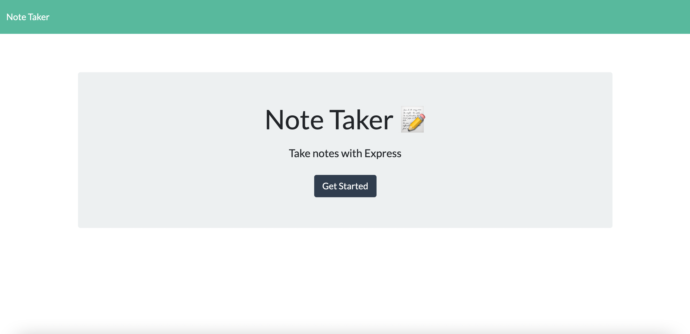
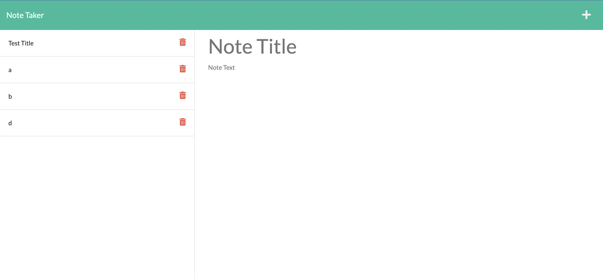
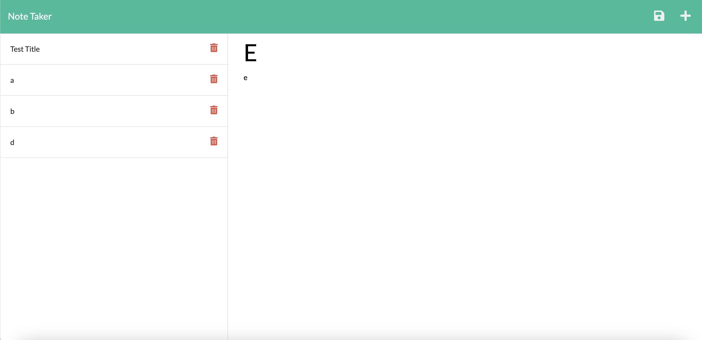

# ideal-note-taker
I have created an application that can be used to jot down notes. The user will be able to also save the notes.

I used Express.js to create the endpoints. The user will be able to save as well as retrieve the notes that are created. 

# Screenshots

# Links
Deployed App: https://ideal-note-taker.herokuapp.com/
GitHub URL: https://github.com/bilalfarrukh2000/ideal-note-taker